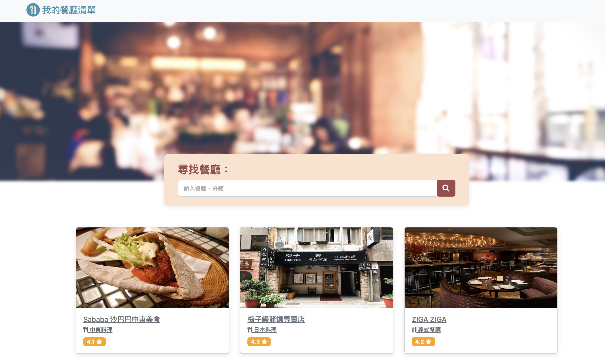

# My Restaurant List

### 介紹
- 紀錄屬於自己的餐廳清單
- 可以瀏覽餐廳、類型和評分，查看詳細資訊
- 地址可以連結到地圖

### 功能
- 查看所有餐廳
- 使用者可以透過搜尋「餐廳名稱」或「餐廳類別」找到特定的餐廳
- 連結餐廳的地址到 Google 地圖

### 驗收：Express框架建立網路應用程式
- 讀取 JSON 檔案，將資料載入應用程式
- 把資料帶入 handlebars 樣板中動態呈現(main./index./show.handlebars)
- 操作 handlebars 中的 each 迴圈呈現出多張餐廳卡片
- 應用 params 打造動態路由
- 用 Query String 打造搜尋功能

## 開始使用
1. 請先確認有安裝 node.js 與 npm
2. 將專案 clone 到本地
3. 在本地開啟之後，透過終端機進入資料夾，輸入：
   ```
   npm install
   ```
4. 安裝完畢後，繼續輸入：
   ```
   npm run start
   ```
5. 若看見此行訊息則代表順利運行，打開瀏覽器進入到以下網址
   ```
   Listening on http://localhost:3000
   ```

6. 若欲暫停使用伺服器
  MAC :  ```control + c```
  Windows : ```ctrl + c```

## 開發工具
- Node.js 18.12.1
- Express 4.16.4
- Express-handlebars 3.0.0
- Bootatrap 5.2.3
- font-awesome 5.8.1


